  

Most of my time goes into BGP measurement. The rest ships to Vercel.

  

**[BGPShield](https://github.com/TanishkaJ26/BGPShield)** is a reproducible, passive-only measurement pipeline for RPKI Route Origin Validation and ASPA adoption across internet routing. It uses only data that public archives already recorded.

Two adjacent publishers on a route is the first point where ASPA can judge anything. Every number on the dashboard can be re-derived with one command. It's a research measurement project, not a product. [Live dashboard](https://tanishkaj26.github.io/BGPShield/)

  
  

  Live: <a href="https://spotlight-five-puce.vercel.app/">Spotlight</a> · <a href="https://wanderlust-iota-nine.vercel.app">WanderLust</a>
   
  Also: <a href="https://github.com/TanishkaJ26/dsa-cpp">dsa-cpp</a>. Working through Striver A2Z in C++.

<!-- AUTO-PROJECTS:START -->
<!-- AUTO-PROJECTS:END -->

  

  <a href="https://www.linkedin.com/in/tanishka-jangir/">LinkedIn</a> · <a href="https://tanishkajangir.vercel.app/">Portfolio</a>
    
  

